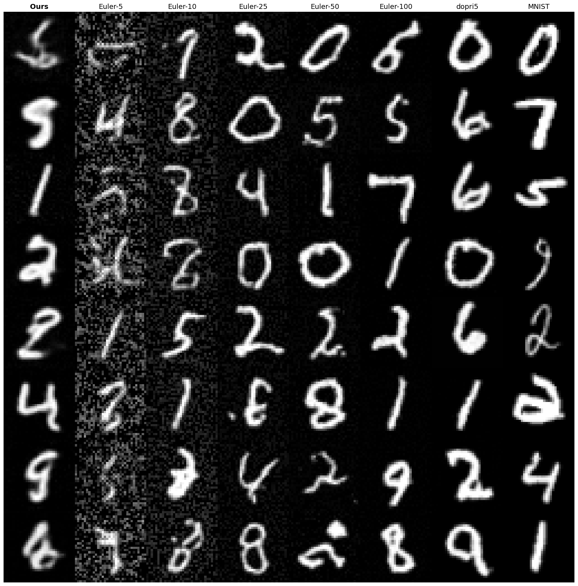
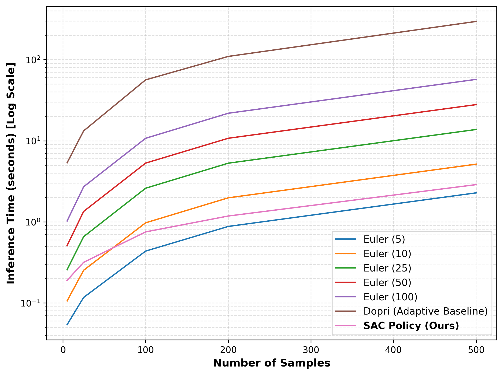
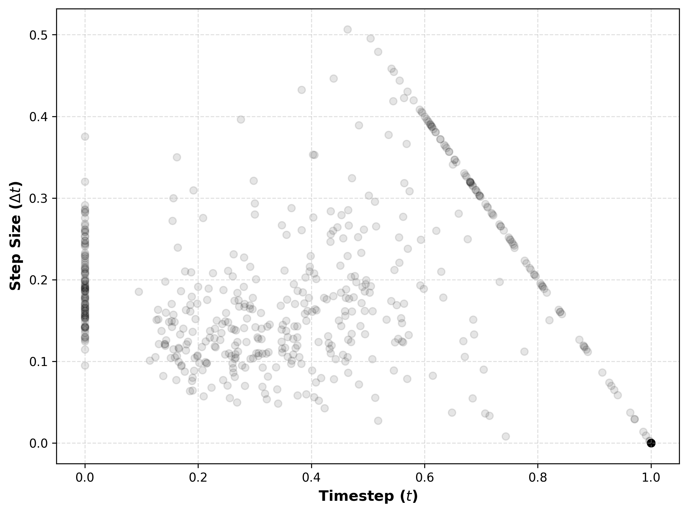
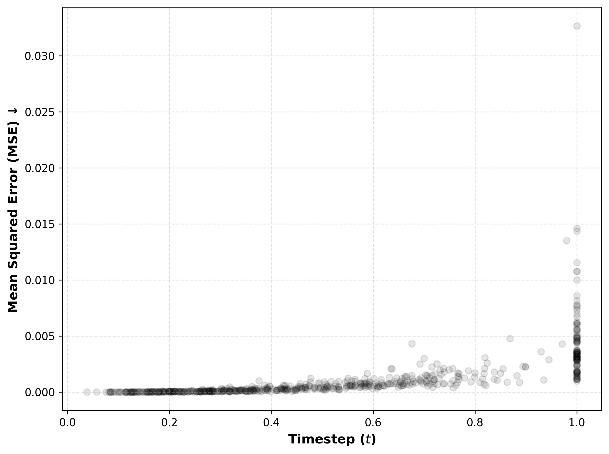
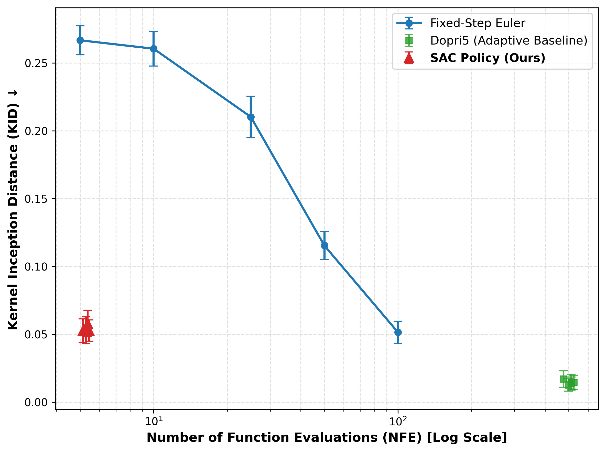

# Dynamic Flow Matching: Learned Adaptive Discretization Policies for Flow Matching

**Author:** Kaito Suzuki | UC Berkeley CS
[[report](https://drive.google.com/file/d/1tlEnViLA7Zd0EdySwHY_g4GIizI9iLks/view?usp=sharing)]

This repository contains the official PyTorch implementation of **Learned Adaptive Discretization Policies for Flow Matching via Constrained RL**.

We formulate the inference-time integration of Optimal Transport (OT) Flow Matching models as a continuous-control Markov Decision Process (MDP). By training a Soft Actor-Critic (SAC) agent to dynamically predict the integration step size ($\Delta t$) based on the spatial features of the current state, we achieve a **20x wall-clock speedup** over classical fixed-step ODE solvers while maintaining equivalent statistical distribution fidelity (KID).

---

## 📋 Table of Contents

1. [🧠 Core Architecture](#-core-architecture--engineering-highlights)
2. [🛠️ Tech Stack](#️-tech-stack)
3. [🚀 Getting Started](#-getting-started)
   - [1. Installation](#1-installation)
   - [2. Baseline Flow Matching](#2-baseline-flow-matching)
   - [3. Precomputing Baseline Trajectories](#3-precomputing-baseline-trajectories)
   - [4. Training the RL Agent](#4-training-the-rl-agent)
   - [5. Inference & Evaluation](#5-inference--evaluation)
4. [📊 Results](#-results)
5. [🗂️ Repository Structure](#️-repository-structure)
6. [🔬 Limitations & Future Work](#-limitations--future-work-constrained-rl)

---

## 🧠 Core Architecture & Engineering Highlights

Training reinforcement learning agents on generative ODE trajectories typically results in catastrophic VRAM Out-Of-Memory (OOM) errors. To bypass this, this repository implements a highly optimized, batched PyTorch training environment:

1. **Pointer-Based Replay Buffer:** Instead of unrolling ODEs online or storing massive high-dimensional image tensors, we precompute a 3.8 GiB dataset of high-precision `dopri5` trajectories. The off-policy Replay Buffer stores lightweight pointer indices, allowing for massive batch sizes without VRAM bottlenecks.
2. **Micro-Rollouts & Snap-Back:** During training, the agent executes an $N=3$ micro-rollout using uniform time sampling $t \sim \mathcal{U}(0, 1)$ and linear interpolation. The environment then executes a "snap-back" mechanism to the true `dopri5` manifold, preventing compounding mathematical drift from corrupting the Q-value estimations.
3. **Continuous Action Space:** The Actor network outputs a parameterized normal distribution using the reparameterization trick to sample continuous integration steps $\Delta t \in (0, 1-t]$.

---

## 🛠️ Tech Stack

- **Language:** Python 3.14+
- **Deep Learning:** PyTorch 2.10.0, TorchVision, TorchMetrics
- **ODE Solvers:** `torchdiffeq` 0.2.5
- **Reinforcement Learning:** Soft Actor-Critic (SAC) implementation
- **Evaluation:** `torch-fidelity` (for KID/FID calculations)
- **Visualization:** Matplotlib, SciPy, NumPy

---

## 🚀 Getting Started

### 1. Installation

Clone the repository and install the dependencies:

```bash
git clone https://github.com/kaitosuzuki-cs/DynamicFlowMatching.git
cd DynamicFlowMatching

# Option A: Using Conda
conda env create -f environment.yml
conda activate dynamic-flow-matching

# Option B: Using Pip
pip install -r requirements.txt
```

### 2. Baseline Flow Matching

First, train the standard Flow Matching model (vector field $v_\theta$):

```bash
python scripts/flow_matching/train.py \
    --model-config-path configs/flow_matching/model_config.yml \
    --train-config-path configs/flow_matching/train_config.yml
```

### 3. Precomputing Baseline Trajectories

Generate high-precision `dopri5` trajectories to serve as the manifold for the RL agent:

```bash
python scripts/dopri5/generate_baseline.py \
    --ckpt-path path/to/flow_matching_ckpt.pt \
    --save-path data/dopri5_trajectories.pt \
    --num-samples 10000
```

### 4. Training the RL Agent

Train the SAC policy to learn adaptive integration steps:

```bash
python scripts/dynamic_flow_matching/train.py \
    --model-config-path configs/dynamic_flow_matching/model_config.yml \
    --train-config-path configs/dynamic_flow_matching/train_config.yml
```

### 5. Inference & Evaluation

Generate samples using the learned adaptive policy:

```bash
python scripts/dynamic_flow_matching/infer.py \
    --ckpt-path path/to/sac_policy_ckpt.pt \
    --mode infer \
    --num-samples 64
```

To run full evaluation (NFE, KID, Pareto Analysis):

```bash
python scripts/dynamic_flow_matching/infer.py \
    --ckpt-path path/to/sac_policy_ckpt.pt \
    --mode evaluate
```

---

## 📊 Results

### Generated Samples


_Visual comparison of generated samples between different integration strategies._

### Performance Analysis

|          Inference Time (Efficiency)          | Timestep Distribution ($\Delta t$)  |
| :-------------------------------------------: | :---------------------------------: |
|  |  |

|                 ODE Divergence                  |   Pareto Frontier (NFE vs. Fidelity)    |
| :---------------------------------------------: | :-------------------------------------: |
|  |  |

_Full resolution PDF plots available in the [samples/](samples/) directory._

---

## 🗂️ Repository Structure

```text
├── configs/                  # YAML configurations for models and training
│   ├── dynamic_flow_matching/ # SAC/RL-based flow matching configs
│   └── flow_matching/         # Baseline flow matching configs
├── env/                      # RL Environment & Data generation
│   ├── env.py                # Batched RL environment (Step, Reset, Reward)
│   ├── generate_baseline.py  # Utility to generate high-precision baseline (dopri5)
│   └── replay_buffer.py      # Pointer-based buffer for efficient VRAM usage
├── models/                   # Core Architectures
│   ├── dynamic_flow_matching.py # SAC Integration & Flow Policy
│   ├── flow_matching.py      # Standard OT Flow Matching implementation
│   ├── flow_model/           # Vector Field (v_theta) Architecture
│   │   ├── blocks/           # Encoder, Decoder, Bottleneck blocks
│   │   └── components/       # Attention, Residual layers
│   └── sac/                  # SAC (Actor-Critic) Components
│       ├── actor.py          # Dual-headed spatial-temporal policy
│       ├── critic.py         # Twin-Q Networks
│       └── components.py     # Supporting SAC layers
├── scripts/                  # Executable scripts for training/inference
│   ├── dopri5/               # Baseline generation
│   ├── dynamic_flow_matching/ # RL training & adaptive inference
│   └── flow_matching/         # Baseline FM training & inference
├── utils/                    # Common utilities
│   ├── dataset.py            # Data loading & preprocessing
│   ├── metric.py             # Evaluation metrics (KID, NFE, etc.)
│   └── misc.py               # Config loading & general helpers
└── samples/                  # Visualized results (PDFs & PNGs)
```

---

## 🔬 Limitations & Future Work: Constrained RL

Our failure analysis (see Technical Report) demonstrates that static, dense spatial penalties (MSE) heavily penalize the agent for finding alternative valid flow paths ("ghost trajectories"). This leads to structural distortions in the generated images.

Future iterations of this codebase will replace the static Lagrangian penalty with a true Instantaneously Constrained Reinforcement Learning (ICRL) formulation, employing primal-dual augmented Lagrangian methods to enforce global trajectory constraints without destroying valid off-path exploration.
